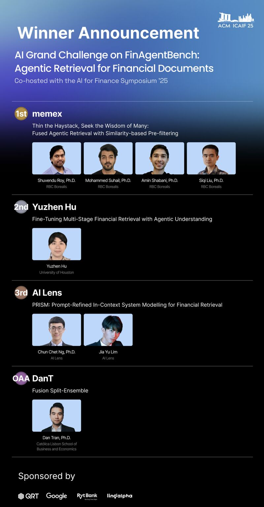

# ACM ICAIF '25 AI Agentic Retrieval Grand Challenge

**Outstanding Achievement Award : public solution**



Agentic system to extract information from SEC filings to answer finance questions.

**Competition**: [ACM ICAIF 2025 AI Agentic Retrieval Grand Challenge](https://www.kaggle.com/competitions/acm-icaif-25-ai-agentic-retrieval-grand-challenge)

## Competition Tasks

**Document Retrieval**: Rank 5 SEC filing types (DEF14A, 10-K, 10-Q, 8-K, Earnings)

**Chunk-text Retrieval**: Select top-5 relevant passages from hundreds of candidates (avg 169 chunks per query)

**Metrics**: MRR@5, MAP@5, nDCG@5 (200 queries each)

## Model: Fusion SE

3-stage split ensemble that progressively filters candidates: **300 -> 50 -> 20 -> 5**

| Stage | Focus | Model | Method |
|-------|-------|-------|--------|
| 1 | Recall | gpt-oss-120b | Hybrid 70% LLM + 30% BM25, split into <=5 parts |
| 2 | Balanced | llama-405b | Pure LLM, split into 2x25 |
| 3 | Precision | llama-405b | Pure LLM, single global pool |

See **[full architecture documentation](docs/model_fusion_se.md)** for design decisions, dataflow diagrams, and infrastructure components.

## Quick Start

```bash
# Install dependencies
uv sync

# Create .env file with API keys (Databricks, OpenAI, Kaggle)

# Download competition data
uv run src/get_data_kaggle.py

# Run model (notebook or script)
# Option 1: notebooks/fusion_se_databricks.ipynb (local or Databricks)
# Option 2:
uv run src/models/fusion_se.py              # experiment mode (dev samples)
uv run src/models/fusion_se.py --production  # full 400 queries
```

## Requirements
- Python 3.12+
- UV package manager
- API keys: Databricks (models), OpenAI (rescue parser), Kaggle (data)

## Citation

```bibtex
@misc{icaif2025-agentic-retrieval,
  title={Fusion SE: Split Ensemble Architecture for Financial Document Ranking},
  author={Dan Tran},
  year={2025},
  howpublished={ACM ICAIF'25 Agentic Retrieval Grand Challenge},
  url={https://github.com/Dan-T24n/Agentic-Retrieval-Challenge-ICAIF25-Public}
}
```